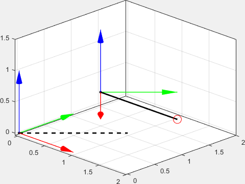

# ReferenceFrame3d

[](https://www.mathworks.com/matlabcentral/fileexchange/XXXXXX-referenceframe3d) <!-- TODO: Replace XXXXXX with File Exchange ID if submitted -->
<!-- Add other badges as needed, e.g., License, Version -->

A MATLAB class to manage complex relationships between reference frames, particularly when plotting 3D scenes.  Intended for tracking, robotics, computer vision, and related fields.


## Overview

The `ReferenceFrame3d` class encapsulates a 3D rigid body transformation, comprising both rotation and translation. A **vector** of `ReferenceFrame3d` objects represents a **transformation sequence** from the base frame of the first element to the local frame of the last element.  

This class is particularly useful for managing reference frames when plotting data.  It uses a hierarchy of efficient `hgtransform` objects to enable the user to plot data in local coordinates and have it automatically appear in the correct world position in the axes.

## Getting Started

### 1. Create and display a reference frame

```matlab
frame = ReferenceFrame3d(eye(3), [0 0 0])
% frame = ReferenceFrame3d() % equivalent
frame.show()
```
> ℹ️ For plotting, you can call 3 different methods depending on your application: 
> * `show()` creates a new figure, creates hgtransforms, and plots the basis vectors for each frame
> * `plot()` creates hgtransforms and plots the basis vectors for each frame (into existing container)
> * `hgtransform()` creates hgtransforms (or gets the current transform, if one exists already)


### 2. Create and display the relationship between two reference frames

Create a `robot` reference frame relative to the `world`.
```matlab
world = ReferenceFrame3d(eye(3), [0 0 0]);
robot = ReferenceFrame3d(); % equivalent to above
robot.reposition([0.5 1 0.5]); % offset w.r.t parent frame's origin
robot.rotate_eulerd(45, 0, 0); % turn 45 degrees (yaw)
```

Transform a vector (`[1 1 0]`--a point in space) from the local frame of the robot to the world frame.
```matlab
frames = [world, robot] % concatenate to describe a transformation sequence
p_world = frames.local2base([1 1 0]) % local of frames(end) to base of frames(1)
```
>p_world = [1.9142,    1.0000,    0.5000]

Let's view this result graphically.

```matlab
show(frames); % creates an hgtransform hierarchy in a new figure
```


We'll plot the same `[1 1 0]` position vector into the local coordinates of each of our frames.  It's critical that we parent each line to the correct `hgtransform`.

```matlab
% plot the point described above in two equivalent ways (note the parent changing)
plot3(robot.hgtransform(), [0 1], [0 1], [0 0], 'k-', 'LineWidth', 2)
plot3(world.hgtransform(), p_world(1), p_world(2), p_world(3), 'ro', 'MarkerSize', 12)

% also draw the [1 1 0] vector expressed in the world frame
plot3(world.hgtransform(), [0 1], [0 1], [0 0], 'k--', 'LineWidth', 2)
```


Notice how by parenting to each reference frame's `hgtransform`, the line gets automatically moved to the correct position in the world frame.  Here, `p_world` is represented by the solid black line and the red circle at its tip.

Any changes made to a `ReferenceFrame3d` will be automatically reflected in the axes (the `hgtransform` is kept in sync with the object state).  For example:

```matlab
world.translate([0.5 0.5 0.25])
```


### 3. Animate a sequence of nested reference frames

See [demo_ReferenceFrame3d](./test/demo_ReferenceFrame3d.m) to explore a more complex 3D plotting scenario with multiple nested reference frames rotating with respect to one another.


# API Overview

## Properties

### Read/Write
*   `T` (4x4 double): The homogeneous transformation matrix.
    * public access
    * transform is validated before setting
    * updates hgtransform object when set (if one exists)
    * recommend setting this property via method `update(rot, origin)` or other methods for rotation, translation, etc

### Read-Only
*   `R` (3x3 double, Dependent): Rotation submatrix.
*   `origin` (3x1 double, Dependent): Translation vector.
*   `x`, `y`, `z` (3x1 double, Dependent): Basis vectors.

## Methods
### Construction

*   `ReferenceFrame3d()`: Default constructor (`eye(4)`).
*   `ReferenceFrame3d(rot)`: Rotation-only constructor.
*   `ReferenceFrame3d(rot, origin)`: Rotation & translation.
*   `update(rot, origin)`: Configure an existing object.

> **Note:** `rot` argument can be 4x4 T, 3x3 R, `ReferenceFrame3d`, `quaternion`, `se3`, or `so3`.

#### Static Constructors (Utility)
*   `ReferenceFrame3d.from_point_normal(point, normal)`: Create a frame to represent a plane using `normal` as `+z` and `point` as the origin. 
*   `ReferenceFrame3d.from_coplanar_vectors(v1, v2, origin)`: Create a frame to represent a plane using two coplanar vectors.

### Transformations

*   `local2base(vec)` or `local2base(x,y,z)`: Transform local coordinates to base.
*   `base2local(vec)` or `base2local(x,y,z)`: Transform base coordinates to local.
*   `translate(dxyz)`: Apply incremental translation.
*   `reposition(new_pos)`: Set absolute origin.
*   `rotate(dcm)`: Apply incremental rotation (3x3 DCM).
*   `rotate_euler(y, p, r)`: Apply incremental ZYX Euler rotation (radians).
*   `rotate_eulerd(y, p, r)`: Apply incremental ZYX Euler rotation (degrees).
*   `compose(frame1, frame2, ...)`: Compose a sequence of frames.
*   `mtimes(other)` or `*`: Overload for composition.
*   `inv()`: Compute inverse transformation.

### Numeric Representations

*   `as_transform()`: Return 4x4 `T`.
*   `as_dcm()`: Return 3x3 `R`.
*   `as_euler()`: Return `[roll, pitch, yaw]` in radians.
*   `as_eulerd()`: Return `[roll, pitch, yaw]` in degrees.

### Toolbox Support (convert to/from MATLAB's built-in types)

These methods are subject to the availability of the relevant toolbox on your machine.
*   `se3()`: Convert to `se3` object.
*   `so3()`: Convert to `so3` object.
*   `quaternion()`: Convert rotation to `quaternion` object.
> **Note:** these objects are also valid as input to the constructor

### Graphics

*   `show()`: Plot the reference frame(s) into a new figure.
*   `plot()`: Plot the basis vectors for one or more frames to an existing axis.  An array of frames is plotted in an hgtransform hierarchy where the first frame is the root.
*   `hgtransform(parent)`: Get or create the underlying `hgtransform` graphics object.  An array of frames creates an hgtransform hierarchy where the first frame is the root.  When plotting, parent your handles to the `obj.hgtransform()` that defines the coordinate frame your data is expressed in.
*   `draw_plane()`: Draw a configurable plane defined by a pair of basis vectors for the frame (e.g. 'xy')
*   `draw_box()`: Draw a configurable rectangular prism (aligned to the basis vectors of the frame)
*   `clear()`: Delete all graphics associated with the object.

> **Important:** a `ReferenceFrame3d` object uses `handle` semantics and can only control at most **one** `hgtransform` at a time!  i.e. if you call `plot()` followed by `show()`, your original plot will get deleted as the new transform is created for your new figure.

### Other

*   `copy()`: Create a deep copy of the object, including handle graphics (if applicable)
    - `ReferenceFrame3d(other_frame)` to shallow copy
*   `intersect_plane()`: Calculate ray-plane intersection.

## License

Distributed under the MIT License. See `LICENSE` file for more information.
